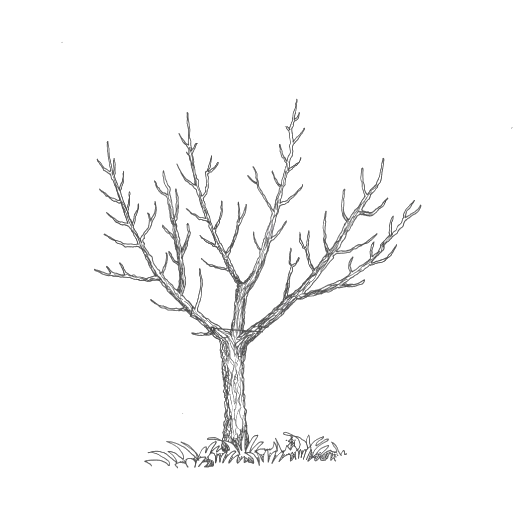

# Pruning

<p>
  <a href="https://pytorch.org/"></a>
</p>

<div style="text-align: center;">
  
</div>

This repo contains the code for the following post: [link](https://psouranis.github.io/blog/2025/pruning-techniques/). 

In order to run the code, you need to have the following installed:

- Python 3.12
- uv installed

To install the dependencies, run:

```bash
uv sync
```

Additionally, you need to download the ImageNet dataset and place it in the `data` folder. 
You can download the dataset from [here](http://www.image-net.org/).

The available pruning methods are:

- Random Unstructured Pruning
- Random Structured Pruning
- L1 Norm Pruning (Unstructured)
- L1 Norm Pruning (Structured)

To run the code, you can use the following command:

```bash
cd ./experiments/imagenet/torch-nn && python python imgnet1k_base_prune.py --prune_method=random_unstructured --pruning_ratio=0.4
```

This will prune the model using the Random Unstructured Pruning method with a pruning ratio of 0.4.

To search for the best pruning ratio, you can use the following command:

```bash
cd ./experiments/imagenet/torch-nn && python python imgnet1k_search.py --prune_method=random_unstructured
```

This will search for the best pruning ratio for the Random Unstructured Pruning method.
You can also prune and fine-tune the model using the following command:

```bash
cd ./experiments/imagenet/torch-nn && python python imgnet1k_prune_finetune.py --prune_method=random_unstructured --pruning_ratio=0.4
```

Last but not least, you can also iteratively prune and finetune using the following command:

```bash
cd ./experiments/imagenet/torch-nn && python python imgnet1k_iterative_finetune.py --prune_method=random_unstructured --pruning_ratio=0.4 --iterations=-1
```

### References

- [A Survey on Deep Neural Network Pruning: Taxonomy, Comparison, Analysis, and Recommendations](https://arxiv.org/pdf/2308.06767)
- [Structured Pruning for Deep Convolutional Neural Networks: A survey](https://arxiv.org/pdf/2303.00566)
- [TorchPruning](https://github.com/VainF/Torch-Pruning)